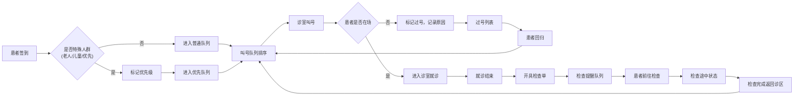

## 1. 产品概述

门诊候诊分流工作台，面向门诊护士、导诊台和患者服务人员，整合诊区队列、检查提醒、过号列表和拥堵状态于统一工作台。解决传统候诊系统信息分散、操作繁琐的问题，提升门诊导诊效率和患者就诊体验。

## 2. 核心功能

### 2.1 用户角色

| 角色 | 使用场景 | 核心需求 |
|------|----------|----------|
| 导诊台人员 | 患者签到、引导分流、特殊人群优先 | 快速识别患者状态、优先引导老人儿童 |
| 门诊护士 | 叫号管理、顺序调整、诊室协调 | 调整叫号顺序时预览影响范围 |
| 患者服务人员 | 检查提醒、过号处理、座位引导 | 查看检查途中患者、处理过号回归 |

### 2.2 功能模块

1. **诊区概览模块**：实时拥堵状态、科室出诊信息、候诊区座位使用率
2. **叫号队列模块**：当前叫号、等待队列、叫号顺序调整
3. **检查提醒模块**：检查预约列表、检查途中患者、检查完成提醒
4. **过号管理模块**：过号列表、过号原因记录、过号患者回归处理
5. **患者详情模块**：患者基本信息、就诊历史、当前状态、优先级标记

### 2.3 页面详情

| 页面名称 | 模块名称 | 功能描述 |
|----------|----------|----------|
| 候诊分流工作台 | 诊区状态面板 | 展示各科室拥堵程度、医生出诊状态、候诊区座位占用 |
| 候诊分流工作台 | 叫号队列面板 | 显示当前叫号、等待患者列表、支持拖拽调整顺序 |
| 候诊分流工作台 | 检查提醒面板 | 待检查患者、检查途中患者、检查完成提醒 |
| 候诊分流工作台 | 过号管理面板 | 过号患者列表、原因标注、回归队列重新安排 |
| 候诊分流工作台 | 患者详情侧边栏 | 点击患者查看详细信息、优先级、特殊标记 |

## 3. 核心流程

## 4. 用户界面设计

### 4.1 设计风格
- **主色调**：医疗蓝 (#165DFF) 作为主色，搭配深灰 (#1D2129) 作为信息密度高的区域背景
- **辅助色**：成功绿 (#00B42A)、警告橙 (#FF7D00)、危险红 (#F53F3F)、信息蓝 (#86909C)
- **按钮样式**：圆角 6px，微妙阴影，hover 状态有轻微上浮动效
- **字体**：使用 Inter 字体家族，标题字重 600，正文字重 400
- **布局风格**：卡片式模块化布局，四象限分布，左侧队列、右侧详情、顶部状态、底部操作
- **图标风格**：使用 lucide-react 线性图标，保持统一的 24px 网格

### 4.2 页面设计概述

| 页面名称 | 模块名称 | UI 元素 |
|----------|----------|---------|
| 候诊分流工作台 | 诊区状态面板 | 科室卡片、状态指示器、进度条、数字徽章 |
| 候诊分流工作台 | 叫号队列面板 | 患者卡片、等待时间标签、优先级徽章、拖拽手柄 |
| 候诊分流工作台 | 检查提醒面板 | 时间线布局、状态步骤指示器、倒计时提醒 |
| 候诊分流工作台 | 过号管理面板 | 红色边框警示、原因标签、快速回归按钮 |
| 候诊分流工作台 | 患者详情侧边栏 | 患者头像、基本信息网格、状态时间轴 |

### 4.3 响应性
- 桌面端优先设计，针对 1920×1080 及以上分辨率优化
- 支持 1366×768 最小分辨率，内部滚动处理长列表
- 不做移动端适配，专注于桌面端工作台体验

### 4.4 动效设计
- 面板切换使用淡入淡出 + 轻微位移
- 叫号更新有脉冲动画提醒
- 拖拽排序有弹性缓动效果
- 状态变化有颜色过渡动画
