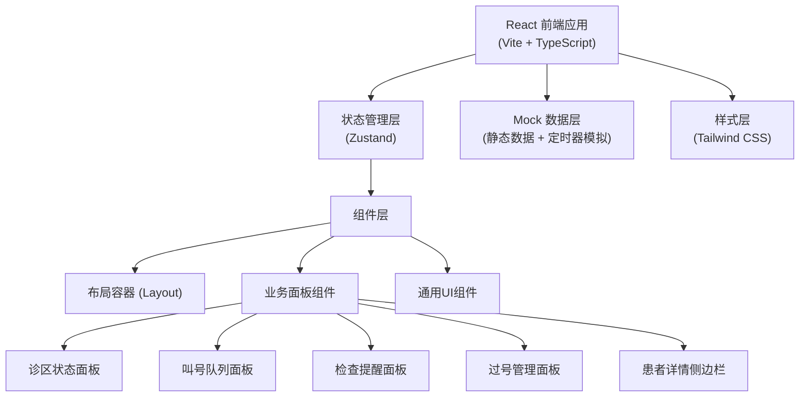

## 1. 架构设计



## 2. 技术描述

- **前端**：React@18 + TypeScript + Vite@5
- **状态管理**：Zustand
- **样式方案**：Tailwind CSS@3
- **图标库**：lucide-react
- **拖拽排序**：@dnd-kit/core + @dnd-kit/sortable
- **数据方案**：Mock 数据，使用 setInterval 模拟实时更新
- **初始化工具**：vite-init (react-ts 模板)

## 3. 路由定义

| 路由 | 用途 |
|------|------|
| / | 候诊分流工作台主页面 |

## 4. 数据模型定义

### 4.1 TypeScript 类型定义

```typescript
// 患者状态
type PatientStatus = 'waiting' | 'called' | 'examing' | 'missed' | 'returned' | 'done';

// 优先级
type Priority = 'normal' | 'elderly' | 'child' | 'emergency' | 'vip';

// 科室
interface Department {
  id: string;
  name: string;
  doctorName: string;
  roomNumber: string;
  congestionLevel: 'low' | 'medium' | 'high' | 'critical';
  waitingCount: number;
  avgWaitTime: number;
  seatTotal: number;
  seatUsed: number;
  isActive: boolean;
}

// 患者
interface Patient {
  id: string;
  name: string;
  age: number;
  gender: 'male' | 'female';
  patientNumber: string;
  departmentId: string;
  priority: Priority;
  status: PatientStatus;
  checkInTime: Date;
  calledTime?: Date;
  estimatedWaitTime: number;
  actualWaitTime?: number;
  examType?: string;
  examRoom?: string;
  missedReason?: string;
  missedCount: number;
  notes?: string;
}

// 检查项目
interface ExamItem {
  id: string;
  patientId: string;
  patientName: string;
  examType: string;
  examRoom: string;
  scheduledTime: Date;
  status: 'scheduled' | 'in-transit' | 'in-progress' | 'completed';
  estimatedDuration: number;
}

// 过号记录
interface MissedRecord {
  id: string;
  patientId: string;
  patientName: string;
  patientNumber: string;
  departmentId: string;
  missedTime: Date;
  reason: string;
  hasReturned: boolean;
  returnedTime?: Date;
}

// 叫号记录
interface CallRecord {
  id: string;
  patientId: string;
  patientName: string;
  patientNumber: string;
  departmentId: string;
  roomNumber: string;
  callTime: Date;
  callCount: number;
  status: 'calling' | 'completed' | 'missed';
}
```

### 4.2 数据状态管理 (Zustand Store)

```typescript
interface ClinicStore {
  departments: Department[];
  waitingQueue: Patient[];
  currentCall: CallRecord | null;
  examItems: ExamItem[];
  missedRecords: MissedRecord[];
  selectedPatient: Patient | null;
  selectedDepartmentId: string | null;
  
  // Actions
  setSelectedDepartment: (id: string | null) => void;
  setSelectedPatient: (patient: Patient | null) => void;
  callNextPatient: () => void;
  recallPatient: (patientId: string) => void;
  movePatientInQueue: (fromIndex: number, toIndex: number) => void;
  markPatientMissed: (patientId: string, reason: string) => void;
  returnMissedPatient: (recordId: string) => void;
  updateExamStatus: (examId: string, status: ExamItem['status']) => void;
  getAffectedPatients: (fromIndex: number, toIndex: number) => Patient[];
}
```

## 5. 组件层级结构

```
src/
├── pages/
│   └── Workbench.tsx           # 主工作台页面
├── components/
│   ├── layout/
│   │   └── DashboardLayout.tsx # 整体布局容器
│   ├── panels/
│   │   ├── DepartmentStatusPanel.tsx  # 诊区状态面板
│   │   ├── CallingQueuePanel.tsx      # 叫号队列面板
│   │   ├── ExamReminderPanel.tsx      # 检查提醒面板
│   │   └── MissedQueuePanel.tsx       # 过号管理面板
│   ├── sidebar/
│   │   └── PatientDetailSidebar.tsx   # 患者详情侧边栏
│   ├── common/
│   │   ├── PatientCard.tsx            # 患者卡片组件
│   │   ├── StatusBadge.tsx            # 状态徽章
│   │   ├── PriorityBadge.tsx          # 优先级徽章
│   │   └── CongestionIndicator.tsx    # 拥堵指示器
│   └── modals/
│       └── AdjustOrderConfirm.tsx     # 调整顺序确认弹窗
├── store/
│   └── useClinicStore.ts      # Zustand 状态管理
├── data/
│   └── mockData.ts            # Mock 数据
├── types/
│   └── index.ts               # TypeScript 类型定义
└── utils/
    └── formatters.ts          # 工具函数
```

## 6. 关键技术实现点

1. **拖拽排序**：使用 @dnd-kit 实现叫号队列拖拽调整，拖拽过程中实时计算受影响患者
2. **实时数据模拟**：使用定时器模拟叫号、检查进度、患者状态变化
3. **响应式面板**：使用 CSS Grid 实现四象限布局，内部滚动处理长列表
4. **状态过渡动画**：使用 Tailwind + CSS transitions 实现状态变化平滑过渡
5. **受影响患者预览**：调整队列顺序时，高亮显示将受影响的患者范围
